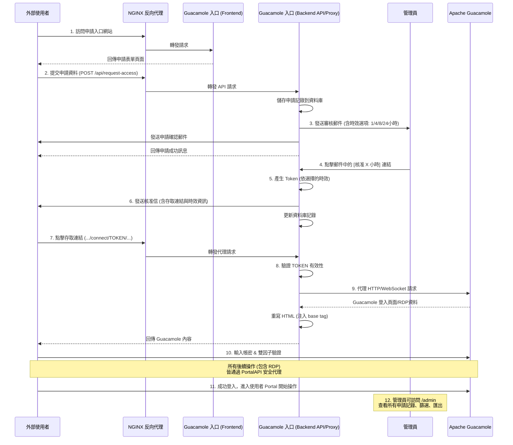

# Guacamole 存取入口 - 技術說明文件

本文檔旨在說明 Guacamole 存取入口的系統架構、運作流程以及關鍵技術實現，以便於系統的維護、部署和二次開發。

## 1. 系統架構

本系統旨在為後端的 Apache Guacamole 提供一個安全、可審核的存取申請流程。它由三個主要部分組成，部署在不同的主機上，由 NGINX 作為統一的流量入口。

### 主機配置

-   **前端 NGINX 反向代理伺服器**: 處理所有來自外部的 HTTPS 請求，並根據路徑將流量轉發到後端的「Guacamole 申請入口」服務。
-   **Guacamole 申請入口 (本專案)**: 一個獨立的 Node.js 應用，包含前端申請介面和後端 API 服務。它負責處理存取申請、審核流程、郵件通知以及最重要的「安全代理」功能。
-   **APACHE GUACAMOLE**: 原始的 Guacamole 服務，安裝有雙因子驗證，處理所有遠端桌面連線。此主機不直接對外開放。

### 網路架構流程圖

```
┌─────────────────────────────────────────────────────────────────┐
│                        外部使用者/廠商                            │
└────────────────────────────┬────────────────────────────────────┘
                             │
                             │ HTTPS (443)
                             ▼
┌─────────────────────────────────────────────────────────────────┐
│              前端 NGINX 反向代理伺服器                           │
│              (gua-acl.your-domain.com)                          │
│                                                                  │
│  location /          → http://10.0.0.67:3000 (前端)           │
│  location /api       → http://10.0.0.67:3001 (後端 API)        │
│  location /connect  → http://10.0.0.67:3001 (後端代理)        │
│  location /admin    → http://10.0.0.67:3000 (管理員頁面)      │
└────────────────────────────┬────────────────────────────────────┘
                             │
                             │ HTTP (內部網路)
                             ▼
┌─────────────────────────────────────────────────────────────────┐
│          Guacamole 申請入口主機 (10.0.0.67)                    │
│                                                                  │
│  ┌──────────────────┐         ┌──────────────────┐            │
│  │  前端服務        │         │  後端 API 服務    │            │
│  │  Port: 3000      │         │  Port: 3001      │            │
│  │                  │         │                  │            │
│  │  - 申請表單      │         │  - API 端點      │            │
│  │  - 管理員面板    │         │  - Token 驗證    │            │
│  │  - 靜態資源      │         │  - 郵件發送      │            │
│  │                  │         │  - 安全代理      │            │
│  │                  │         │  - WebSocket代理 │            │
│  └──────────────────┘         └────────┬─────────┘            │
│                                         │                       │
│                                         │ HTTP/WebSocket        │
│                                         │ (驗證 Token 後)       │
└─────────────────────────────────────────┼───────────────────────┘
                                           │
                                           │ HTTP (內部網路)
                                           ▼
┌─────────────────────────────────────────────────────────────────┐
│          Apache Guacamole 主機 (10.0.0.50:8080)                │
│                                                                  │
│  - Guacamole 登入頁面                                            │
│  - 雙因子驗證                                                    │
│  - RDP/VNC/SSH 連線服務                                          │
└─────────────────────────────────────────────────────────────────┘
```

### 完整流程圖



## 2. 運作流程

使用者從申請到最終連線的完整流程如下：

1.  **外部廠商/使用者** 訪問由 NGINX 代理的 Guacamole 申請入口網站。
2.  使用者填寫姓名、郵件、部門、原因等資訊，並提交申請。
3.  後端 API 收到請求，將申請紀錄儲存到資料庫，並向 **管理者** 發送一封包含「核准 1 小時」、「核准 4 小時」、「核准 8 小時」、「核准 24 小時」和「拒絕」連結的審核郵件。
4.  管理者點擊其中一個「核准 X 小時」連結，選擇此次授權的有效時長。
5.  後端 API 驗證請求，根據管理者選擇的時長產生一個有時效性的 **一次性存取權杖 (Token)**，並將一封包含此權杖的存取連結郵件發送給申請人。郵件中會明確顯示核准時間、到期時間和有效時長。
6.  使用者點擊郵件中的 **存取連結**。
7.  瀏覽器跳轉到 `.../connect/{TOKEN}` 路徑，此請求被 NGINX 轉發到後端 API。
8.  後端 API 驗證 Token 的有效性，驗證通過後，它作為一個 **安全代理 (Secure Proxy)**，將所有後續請求轉發到內網的 **Apache Guacamole**。
9.  使用者看到 Guacamole 的登入畫面，輸入帳號密碼，並進行 **雙因子驗證**。
10. 成功登入後，使用者看到自己的 Portal，可以開始使用已授權的 RDP 服務。所有 RDP 的畫面和操作資料流，也都會通過這個已驗證的代理通道進行傳輸。

### 管理員功能流程

1.  **管理員訪問** `https://your-domain.com/admin` 進入管理員登入頁面。
2.  輸入管理員密碼進行登入。
3.  進入管理員面板，可查看：
    - 統計資訊（總申請數、待審核、已核准、已拒絕）
    - 完整的申請記錄列表
    - 進階篩選功能（狀態、電子郵件、日期範圍）
    - CSV 匯出功能

## 3. 關鍵技術實現

### 3.1. Token-Based 存取控制

-   **安全性**: 外部使用者永遠不會直接接觸到後端 Apache Guacamole 的真實 IP 和 Port。所有存取都必須通過一個有時效性的 Token。
-   **彈性時效**: 管理者可以針對每次申請選擇不同的有效時長（1、4、8、24 小時），提供更靈活的安全控制。
-   **一次性**: Token 在過期後即失效，防止連結被重複使用或外洩。
-   **可審核**: 所有的申請和核准操作都有完整的資料庫紀錄，包含申請時間、處理時間、有效時長等資訊。

### 3.2. 管理者自訂時效性

-   **動態時效設定**: 管理者在核准申請時，可以選擇 1、4、8 或 24 小時的有效時長。
-   **明確的時效資訊**: 使用者收到的核准郵件中，會清楚顯示：
    - 管理者核准的可連線時間
    - 核准時間（起）
    - 到期時間（止）
    - 有效時長
-   **資料庫記錄**: 每次核准的時效設定都會記錄在資料庫的 `duration_hours` 欄位中。

### 3.3. Node.js 安全代理 (/connect/:token)

這是整個系統的核心。後端 API 的 `/connect/:token` 端點不僅是一個簡單的 API，它還是一個功能完整的反向代理。

-   **HTTP 代理**: 當使用者訪問 Guacamole 頁面時，代理會攔截所有 HTTP 請求，驗證 URL 中的 Token，然後才向後端 Guacamole 發出請求，並將結果回傳給使用者。
-   **WebSocket 代理**: 當使用者成功登入並啟動 RDP 連線時，Guacamole 會嘗試建立一個 WebSocket 長連線。代理伺服器能監聽到這個「升級 (Upgrade)」請求，在驗證 Token 後，同樣將其代理到後端，從而打通 RDP 的即時資料流。
-   **路徑處理**: 代理會自動處理 Guacamole 的基礎路徑（支援有或無 `/guacamole` 前綴），並正確轉發所有子路徑和查詢參數。

### 3.4. 動態 HTML 重寫

由於使用者是透過 `.../connect/{TOKEN}` 這個路徑來訪問 Guacamole，但 Guacamole 本身並不知道這個前綴的存在，它回傳的 HTML 中的資源路徑 (如 CSS, JS) 仍然是 `/app.css` 這樣的相對路徑。

為了解決這個問題，代理伺服器在收到來自 Guacamole 的 HTML 回應後，會：

1.  **動態注入 `<base>` 標籤**: 在 HTML 的 `<head>` 中插入 `<base href="/connect/{TOKEN}/">` 標籤。這會告訴瀏覽器，頁面上的所有相對路徑都以此為基礎，確保資源可以被正確地再次經由代理加載。
2.  **重寫資源路徑**: 重寫 HTML 中的 `src`、`href` 和 CSS 中的 `url()` 屬性，確保所有資源請求都通過代理。
3.  **重寫 Location 標頭**: 如果 Guacamole 回傳了重定向 (HTTP 302)，代理也會重寫 `Location` 標頭，確保使用者被重定向到正確的代理路徑下，而不是原始的 Guacamole 路徑。
4.  **禁用壓縮**: 為了能夠修改 HTML 內容，代理會強制使用 `accept-encoding: identity`，確保收到未壓縮的內容。

### 3.5. 管理員面板

-   **獨立路由**: 管理員頁面使用獨立的 `/admin` 路由，與一般使用者流程完全分離。
-   **Token 認證**: 使用安全的 Token-based 認證系統，Token 儲存在 localStorage 中。
-   **完整記錄查詢**: 
    - 查看所有申請記錄（包含申請資訊、狀態、時間、時長）
    - 進階篩選（狀態、電子郵件、日期範圍）
    - 統計資訊（總申請數、待審核、已核准、已拒絕）
-   **CSV 匯出**: 可匯出篩選後的記錄為 Excel 相容的 CSV 格式，包含所有欄位資訊。

### 3.6. 安全性強化

-   **環境變數保護**: 敏感資訊（SMTP 密碼、管理員密碼）儲存在 `.env` 檔案中，權限設為 600（僅 root 可讀寫）。
-   **資料庫安全**: SQLite 資料庫檔案位於後端目錄，僅應用程式可存取。
-   **Token 管理**: 管理員 Token 使用全域 Set 儲存（生產環境建議改用 Redis 或資料庫）。

## 4. 資料庫結構

系統使用 SQLite 資料庫儲存所有申請記錄，資料表結構如下：

```sql
CREATE TABLE access_requests (
  id INTEGER PRIMARY KEY AUTOINCREMENT,
  request_id TEXT UNIQUE,              -- 申請編號
  name TEXT NOT NULL,                  -- 申請人姓名
  email TEXT NOT NULL,                 -- 申請人電子郵件
  department TEXT,                     -- 部門（選填）
  reason TEXT NOT NULL,                -- 申請原因
  status TEXT DEFAULT 'pending',       -- 狀態: pending/approved/rejected
  access_token TEXT,                   -- 存取權杖
  created_at DATETIME DEFAULT CURRENT_TIMESTAMP,  -- 申請時間
  approved_at DATETIME,                -- 核准時間
  expires_at DATETIME,                 -- 到期時間
  duration_hours INTEGER               -- 有效時長（小時）
);
```

## 5. API 端點說明

### 使用者端點

-   `POST /api/request-access`: 提交存取申請
-   `GET /api/verify-access/:token`: 驗證存取權杖

### 管理員端點（需要認證）

-   `POST /api/admin/login`: 管理員登入
-   `GET /api/admin/requests`: 查詢申請記錄（支援篩選）
-   `GET /api/admin/requests/export`: 匯出申請記錄為 CSV

### 代理端點

-   `ALL /connect/:token*`: 代理所有 Guacamole 請求（HTTP 和 WebSocket）

## 6. NGINX 配置範例

為了讓整個系統正常運作，前端的 NGINX 反向代理需要正確配置，以下是一個推薦的配置範例：

```nginx
server {
    listen 443 ssl;
    server_name gua-acl.your-domain.com;

    # SSL 憑證設定
    ssl_certificate /etc/ssl/certs/demo.crt;
    ssl_certificate_key /etc/ssl/private/demo.key;
    ssl_protocols TLSv1.2 TLSv1.3;
    ssl_ciphers ECDHE-ECDSA-AES128-GCM-SHA256:ECDHE-RSA-AES128-GCM-SHA256:ECDHE-ECDSA-AES256-GCM-SHA384:ECDHE-RSA-AES256-GCM-SHA384;
    ssl_prefer_server_ciphers off;
    ssl_session_cache shared:SSL:10m;
    ssl_session_timeout 1d;

    # 安全標頭
    add_header X-Frame-Options "SAMEORIGIN" always;
    add_header X-Content-Type-Options "nosniff" always;
    add_header X-XSS-Protection "1; mode=block" always;

    # Guacamole 申請入口 (前端)
    location / {
        proxy_pass http://10.0.0.67:3000;
        proxy_http_version 1.1;
        proxy_set_header Host $host;
        proxy_set_header X-Real-IP $remote_addr;
        proxy_set_header X-Forwarded-For $proxy_add_x_forwarded_for;
        proxy_set_header X-Forwarded-Proto $scheme;
        proxy_read_timeout 90;
    }

    # Guacamole 申請入口 (後端 API)
    # /api 和 /connect 都指向後端
    location ~ ^/(api|connect)/ {
        proxy_pass http://10.0.0.67:3001; # << 指向 Guacamole 入口的後端 Port
        proxy_set_header Host $host;
        proxy_set_header X-Real-IP $remote_addr;
        proxy_set_header X-Forwarded-For $proxy_add_x_forwarded_for;
        proxy_set_header X-Forwarded-Proto $scheme;

        # WebSocket 支援 (非常重要!)
        proxy_set_header Upgrade $http_upgrade;
        proxy_set_header Connection "upgrade";

        # 增加超時以支援長時間的 RDP 連線
        proxy_connect_timeout 3600s;
        proxy_send_timeout 3600s;
        proxy_read_timeout 3600s;

    }

    # 日誌設定
    access_log /var/log/nginx/guacamole-portal.access.log;
    error_log /var/log/nginx/guacamole-portal.error.log;
}
```

## 7. 部署說明

### 7.1. 系統需求

-   Ubuntu 18.04/20.04/22.04/24.04
-   Node.js 20.x LTS（長期支援版本，支援至 2026年4月）
-   npm（最新版本，部署時會自動更新）
-   PM2（程序管理器）
-   SQLite3（內建於 Node.js）

### 7.2. 部署步驟

1.  執行部署腳本：
    ```bash
    bash guacamole-portal-deploy-full.sh
    ```

2.  依提示輸入配置資訊：
    - 前端網址（例如：`https://your-domain.com`）
    - API 網址（通常與前端網址相同）
    - Guacamole 網址（例如：`http://10.0.0.50:8080`）
    - SMTP 設定（主機、端口、帳號、密碼）
    - 管理員郵件地址
    - 管理員密碼

3.  腳本會自動：
    - 安裝系統依賴
    - 安裝 Node.js 20.x LTS 和最新版 npm
    - 安裝 PM2 程序管理器
    - 建立後端 API 服務
    - 建立前端靜態頁面
    - 配置 PM2 服務
    - 設定環境變數檔案（`.env`，權限 600）
    - 自動修復 npm 安全漏洞

**注意**: 部署過程中可能會看到 `npm warn deprecated` 警告訊息，這些是 npm 內部依賴套件的警告，屬於正常現象，不影響功能運作。

### 7.3. 服務管理

```bash
# 查看服務狀態
pm2 list

# 查看日誌
pm2 logs

# 重啟所有服務
pm2 restart all

# 停止所有服務
pm2 stop all
```

### 7.4. 移除安裝

如需完全移除系統，可使用移除腳本：

```bash
bash guacamole-portal-uninstall.sh
```

移除腳本會執行以下操作：
1. 停止並刪除 PM2 服務（guacamole-api, guacamole-frontend）
2. 刪除安裝目錄（`/opt/guacamole-portal`）及所有資料
3. 詢問是否移除 PM2（可選）
4. 詢問是否移除 Node.js（可選，需注意可能影響其他應用程式）
5. 詢問是否關閉防火牆 port 3000 和 3001（可選）

**重要**: 移除操作會刪除所有申請記錄（資料庫），請在移除前確認是否需要備份資料。

### 7.5. 環境變數檔案

敏感資訊儲存在 `/opt/guacamole-portal/backend/.env` 檔案中：

```
PORT=3001
NODE_ENV=production
SMTP_HOST=smtp.gmail.com
SMTP_PORT=587
SMTP_USER=guacamole@gmail.com
SMTP_PASS=your_smtp_password
ADMIN_EMAIL=admin@example.com
ADMIN_PASSWORD=your_admin_password
BASE_URL=https://your-domain.com
API_URL=https://your-domain.com
GUACAMOLE_URL=http://10.0.0.50:8080
GUACAMOLE_HOST=10.0.0.50
GUACAMOLE_PORT=8080
```

**重要**: 此檔案權限已設為 600（僅 root 可讀寫），請勿將此檔案分享或提交到版本控制系統。

## 8. 管理員功能說明

### 8.1. 訪問管理員面板

-   **URL**: `https://your-domain.com/admin`
-   **認證**: 輸入部署時設定的管理員密碼

### 8.2. 功能列表

1.  **統計儀表板**
    - 總申請數
    - 待審核數量
    - 已核准數量
    - 已拒絕數量

2.  **申請記錄查詢**
    - 顯示所有申請的詳細資訊
    - 申請人資訊（姓名、郵件、部門）
    - 申請原因
    - 狀態（待審核/已核准/已拒絕）
    - 申請時間、處理時間
    - 有效時長、到期時間

3.  **進階篩選**
    - 按狀態篩選（全部/待審核/已核准/已拒絕）
    - 按電子郵件搜尋
    - 按日期範圍篩選（開始日期、結束日期）

4.  **CSV 匯出**
    - 匯出當前篩選結果為 CSV 格式
    - 包含所有欄位資訊
    - Excel 相容格式

## 9. 安全性考量

### 9.1. Token 安全

-   Token 使用加密安全的隨機數產生器產生
-   每個 Token 都有明確的過期時間
-   Token 驗證失敗時會立即拒絕請求

### 9.2. 資料保護

-   敏感資訊（密碼）儲存在 `.env` 檔案中，權限設為 600
-   資料庫檔案位於受保護的目錄中
-   所有 API 請求都經過適當的驗證

### 9.3. 代理安全

-   所有對 Guacamole 的請求都必須通過 Token 驗證
-   代理會驗證每個請求的 Token 有效性
-   WebSocket 連線也需要通過 Token 驗證

## 10. 故障排除

### 10.1. 常見問題

**問題**: 申請提交後沒有收到郵件
-   **檢查**: SMTP 設定是否正確
-   **檢查**: 防火牆是否允許 SMTP 連線
-   **檢查**: PM2 日誌中的錯誤訊息

**問題**: 無法連接到 Guacamole
-   **檢查**: Guacamole 主機是否可達
-   **檢查**: Token 是否有效且未過期
-   **檢查**: NGINX 的 `/connect` location 配置是否正確

**問題**: RDP 連線無法建立
-   **檢查**: NGINX 是否正確配置了 WebSocket 支援
-   **檢查**: PM2 日誌中的 WebSocket 代理錯誤
-   **檢查**: 後端 API 的 WebSocket 處理邏輯

**問題**: 管理員面板無法載入數據
-   **檢查**: 管理員是否已正確登入
-   **檢查**: Token 是否有效
-   **檢查**: 瀏覽器控制台的錯誤訊息

**問題**: 部署時看到 npm deprecated 警告
-   **說明**: 這些警告是 npm 內部依賴套件的警告，屬於正常現象，不影響功能運作
-   **處理**: 無需處理，系統會自動使用最新版本的依賴套件

### 10.2. 日誌查看

```bash
# 查看所有服務日誌
pm2 logs

# 僅查看後端 API 日誌
pm2 logs guacamole-api

# 僅查看前端日誌
pm2 logs guacamole-frontend

# 查看 NGINX 日誌
tail -f /var/log/nginx/guacamole-portal.access.log
tail -f /var/log/nginx/guacamole-portal.error.log
```

## 11. 版本資訊

-   **版本**: 1.2.0
-   **最後更新**: 2025-01-XX
-   **Node.js 版本**: 20.x LTS（長期支援至 2026年4月）
-   **主要功能**:
    - ✅ 完整的申請與審核流程
    - ✅ 管理者自訂權杖時效性（1/4/8/24 小時）
    - ✅ 安全代理功能（HTTP + WebSocket）
    - ✅ 管理員面板（查詢、篩選、匯出）
    - ✅ 完整的資料庫記錄
    - ✅ 安全性強化（環境變數保護）
    - ✅ 自動更新 npm 到最新版本
    - ✅ 自動修復 npm 安全漏洞

### 11.1. 依賴套件版本

**後端依賴**:
- `cors`: ^2.8.5
- `dotenv`: ^16.4.7
- `express`: ^4.21.2
- `http-proxy`: ^1.18.1
- `nodemailer`: ^7.0.10
- `sqlite3`: ^5.1.7

**前端依賴**:
- `compression`: ^1.7.4
- `express`: ^4.21.2
- `http-proxy-middleware`: ^3.0.3

## 12. 聯絡資訊

如有技術問題或需要支援，請聯繫系統管理員。

